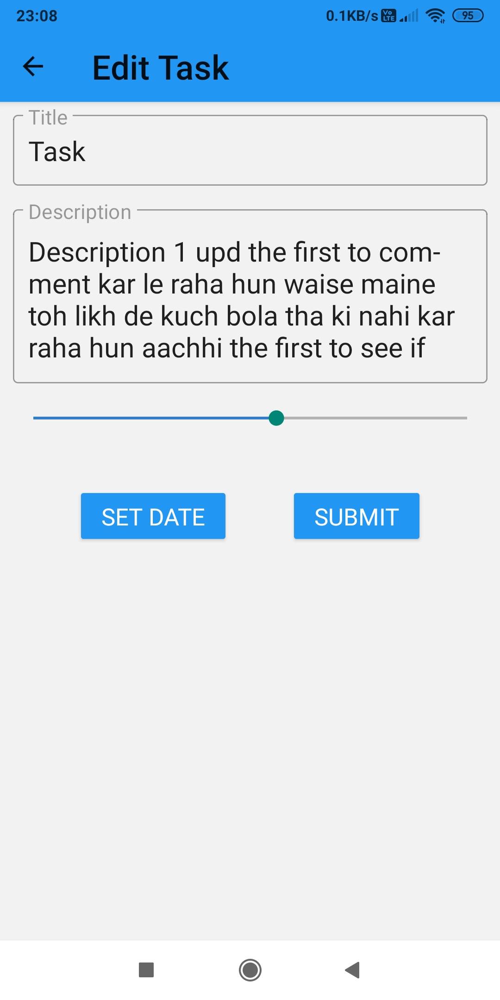

# Repository Title Goes Here

> A react native cross-platform application for managing tasks in your day to day life.Feature complete with create,read,update,delete.

> #React-native, #expo,#material-ui

## Installation

### Clone

Clone this repo to your local machine using

### Setup

Set up expo cli globally in your system
```
npm install
npm start
```

## Features

> View all tasks and progress bar

> Look at a particular task

> Create a new task

> editing an old task

> adding date

